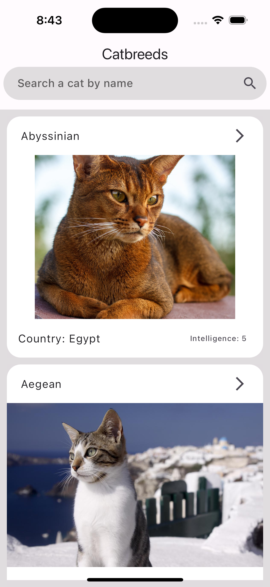
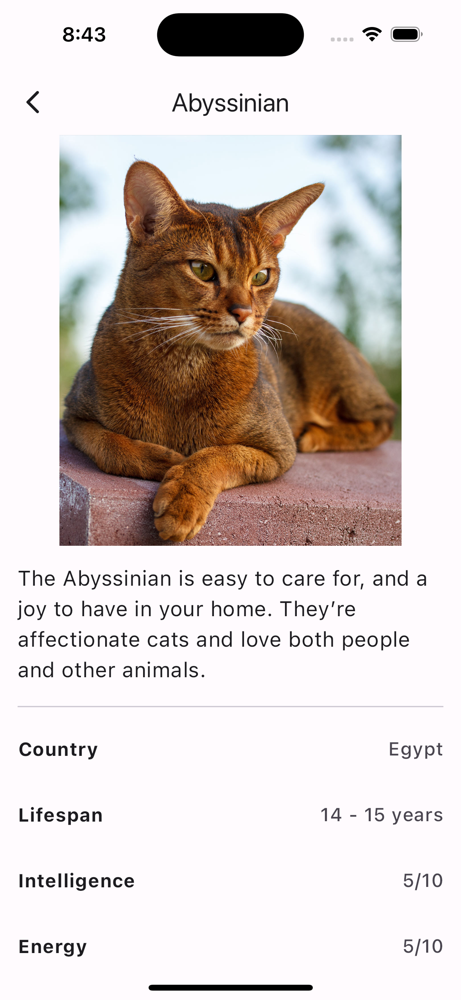
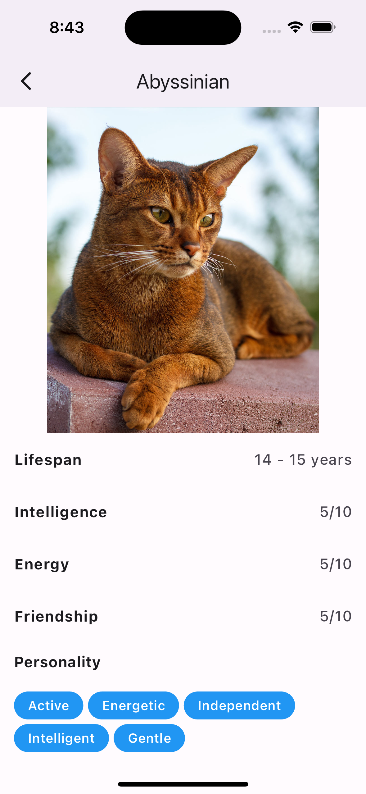

# Catbreets

App for see all about cats

## Environment
- Macbook Pro M1 2020 (arm64)
    - Sonora 14.4.1
- Emulador IOS 17.4 - Iphone 15 Pro
- Flutter version 3.19.3
- Android SDK version 34.0.0
- Xcode version 15.3

## Dependencies
- flutter
- dart
- flutter_bloc
- bloc
- dio
- equatable
- flutter_dotenv
- flutter_native_splash
- go_router

## Init Project

1. Download repository

2. Install dependencies
````bash
flutter pub get
````

3. Create `.env` file
```bash
cp .env.template .env
```

4. Set variables for environment:
- For create and api key for use, it's necessary go to [The Cat API](https://thecatapi.com) and create and account.

5. For change splash screen
````bash
dart run flutter_native_splash:create
````
!important: The app should not be running

## Demo

Some demo screenshots for app running

### Home Screen


### Details Screen


- more details


